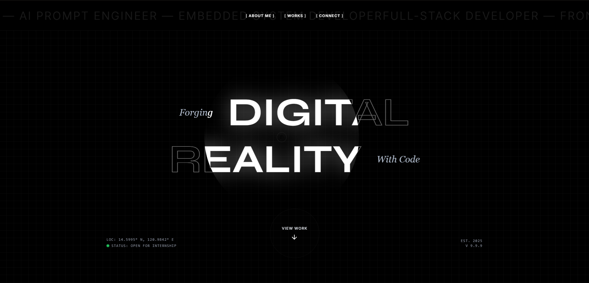

<div align="center">
<a href="#" target="_blank">
  
</a>

# Nexus Portfolio

### A Modern, Interactive Developer Portfolio

[](https://react.dev/)
[](https://www.typescriptlang.org/)
[](https://vitejs.dev/)
[](https://www.framer.com/motion/)
[](https://greensock.com/gsap/)

</div>

## 📖 About

A high-performance, visually stunning developer portfolio showcasing creative development work. Built with modern web technologies, this portfolio features:

- **🎨 Bold Typography & Design** - Ultra-modern aesthetic with particle physics and smooth animations
- **💬 AI-Powered Assistant** - Interactive chatbot powered by Google Gemini API
- **⚡ Blazing Fast** - Built with Vite for instant hot module replacement
- **🎭 Smooth Animations** - Leveraging Framer Motion and GSAP for fluid transitions
- **📱 Fully Responsive** - Optimized for all devices and screen sizes
- **🎯 Custom Cursor** - Interactive cursor effects for enhanced user experience
- **♿ Accessible** - Semantic HTML and keyboard navigation support

## 🚀 Tech Stack

- **Frontend Framework:** React 19
- **Language:** TypeScript
- **Build Tool:** Vite
- **Animation Libraries:** Framer Motion, GSAP
- **AI Integration:** Google Gemini API
- **Styling:** Tailwind CSS (via CDN)

## 🛠️ Run Locally

**Prerequisites:** Node.js (v18 or higher)

1. **Clone the repository**
   ```bash
   git clone <repository-url>
   cd perry-portfolio
   ```

2. **Install dependencies**
   ```bash
   npm install
   ```

3. **Set up environment variables**
   
   Create a `.env.local` file and add your Gemini API key:
   ```env
   VITE_GEMINI_API_KEY=your_api_key_here
   ```

4. **Run the development server**
   ```bash
   npm run dev
   ```

5. **Build for production**
   ```bash
   npm run build
   ```

6. **Preview production build**
   ```bash
   npm run preview
   ```

## 📂 Project Structure

```
nexus-portfolio/
├── components/          # React components
│   ├── Hero.tsx        # Landing section with spotlight effect
│   ├── About.tsx       # About section with parallax image
│   ├── TechStack.tsx   # Technology showcase
│   ├── Projects.tsx    # Portfolio showcase
│   ├── Contact.tsx     # Contact section
│   ├── AIChat.tsx      # AI chatbot assistant
│   ├── Navbar.tsx      # Navigation bar
│   ├── CustomCursor.tsx # Custom cursor component
│   ├── ParticleBackground.tsx # Particle physics background
│   ├── SmoothScroll.tsx # Smooth scrolling wrapper
│   └── ...
├── services/           # API integrations
│   └── geminiService.ts # Gemini AI service
├── public/             # Static assets
│   ├── profile-image.jpg
│   ├── Uy_Resume.pdf
│   └── ...
├── index.html          # Entry HTML
├── App.tsx             # Main app component
├── metadata.json       # App metadata
└── package.json        # Dependencies
```

## 🎯 Featured Projects

- **PATHLINK** - IoT Car Rental Management System with real-time GPS tracking
- **Arya Kopi** - Inventory & POS System for coffee shop operations
- **Portfolio Website** - Dynamic personal portfolio with login system
- **Rizal's Mi Ultimo Adios** - Educational interactive website

## 🤝 Contact

Perry Gabriel Uy - perryuy31@yahoo.com

[](https://www.facebook.com/Zen1th.GG)
[](https://www.linkedin.com/in/perry-uy-456931252)
[](https://github.com/Zen1thh)

---

